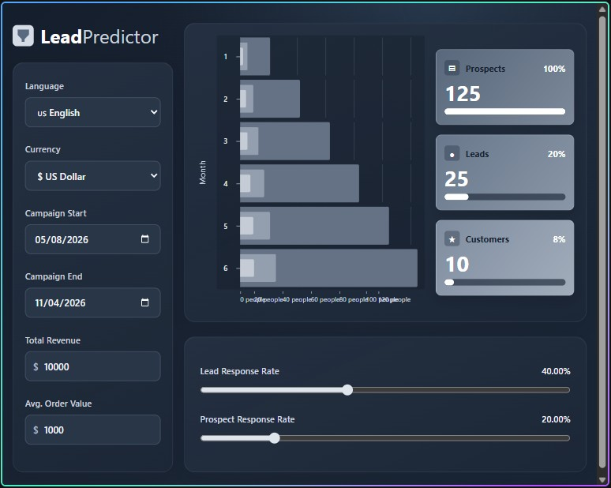

# LeadPredictor Calculator

An interactive campaign forecast calculator that estimates customers, leads, and prospects from revenue, average order value, and response rates.

## Preview

## Features

- Interactive revenue, average order value, campaign date, currency, and response-rate controls.
- English and Bulgarian language choices.
- US Dollar, Euro, British Pound, and Bulgarian Lev currency choices.
- Responsive campaign chart and summary cards.
- Shareable URL settings and locally persisted preferences.
- Accessible forecast-update announcements.

## Calculation logic

- Customers = Total Revenue / Average Order Value
- Leads = Customers × 100 / Lead Response Rate
- Prospects = Leads × 100 / Prospect Response Rate

Each result rounds up to the next whole person.

For example, $10,000 revenue, a $1,000 average order value, a 40% lead response rate, and a 20% prospect response rate produce 10 customers, 25 leads, and 125 prospects.

Campaign dates set the inclusive calendar months displayed in the chart. Forecast totals are divided across those months, with any remainder assigned to earlier months. Revenue and average order value must both be finite positive numbers.

## Run locally

This is a static site. Open `index.html` directly in a modern browser or use a local static server such as VS Code Live Server. No package installation is required.

## Live deployment

The live app is available at [playful-swan-db54f3.netlify.app](https://playful-swan-db54f3.netlify.app/). Netlify deploys the `main` branch. The project uses `netlify.toml` to publish the repository root without a build command.

## Project structure

- `index.html` — calculator page structure and controls.
- `styles.css` — dashboard styling and responsive layout.
- `app.js` — calculations, chart rendering, saved preferences, and shareable URL settings.
- `netlify.toml` — static publish directory and response headers.
- `docs/` — project screenshots, including the dashboard preview.